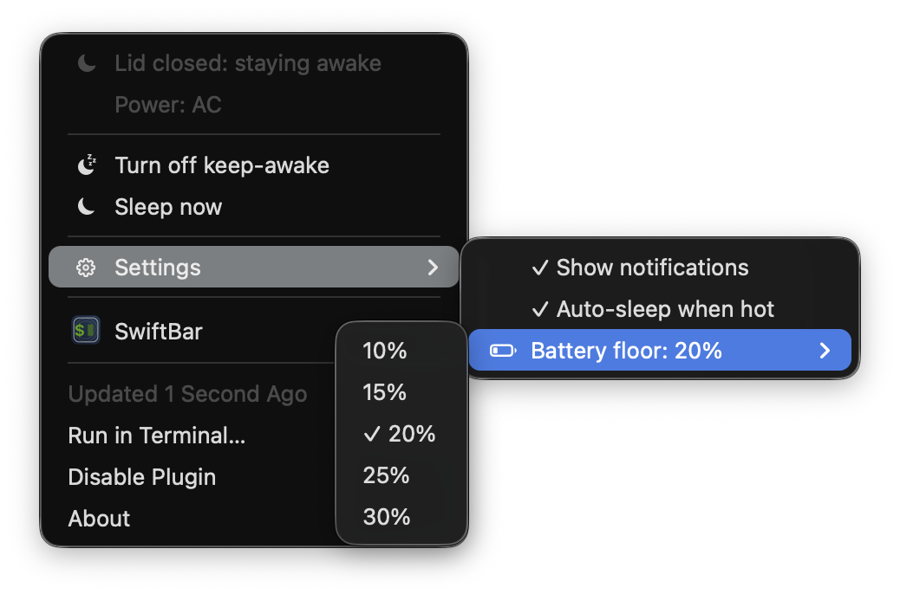

# lid-awake

Keep your MacBook running with the lid closed, and it cleans up after itself.



By default, closing the lid sleeps your Mac, exactly like normal. When you actually want it to keep working with the lid shut, you turn that on with one click in the menu bar.

The whole point is what happens after: it turns itself back off. Unplug it, open the lid, drop under 20% battery, or let it start overheating on battery, and it goes back to sleeping normally on its own. You never have to remember you left it awake.

Most keep-awake apps just flip a switch and leave the rest to you. That is how a laptop ends up hot and draining in a bag. This one puts it back the way it found it.

## What it does

- **Closed lid, on power:** keeps running. Turns on by itself when you plug in.
- **Closed lid, on battery:** stays asleep by default. One click keeps it awake for a while, and also switches on Low Power Mode so a closed laptop stays cool.
- **Any override ends on its own:** open the lid, unplug, go under 20%, or start overheating, and it reverts.
- **Battery floor (default 20%):** won't arm an override within 5% of the floor, and drops it once battery goes under the floor. If the machine hits serious thermal pressure on battery, it sleeps and tells you.

Menu and notifications follow your Mac's language: English, German, French, and Spanish, with English as the fallback. You can mute notifications from the menu; everything keeps working silently. Native menu-bar icons, a few hundred lines of plain bash, MIT.


## Overheating protection

While it keeps a closed laptop awake on battery, the guard checks macOS's own thermal pressure level every 60 seconds (via a tiny bundled helper, `thermalstate`, that reads `NSProcessInfo.thermalState`, working on both Intel and Apple Silicon). If the system reports serious thermal pressure, it puts the Mac to sleep so it can cool, and leaves you a plain note like:

> Went to sleep due to overheating at 2:35pm on Saturday, 15 Aug

The note shows up in Notification Center, so you see exactly what happened and when. There's also a one-line text history at `~/.lid-awake/state/thermal-history.txt` if you want to look back.

## Adjustable, on by default

Both safety limits are on out of the box and adjustable from the menu:
- **Thermal auto-sleep** (thermometer icon): on or off.
- **Battery floor** (battery icon): pick 10, 15, 20, 25, or 30%. The Mac won't arm an override within 5% of the floor, and drops the override once battery goes under it.

## Battery floors

- **Refuses to arm within 5% of the battery floor** (e.g. below 25% at the default 20% floor).
- **Revokes an active override once battery goes under the floor** and lets the Mac sleep. Both adjustable from the menu.

## Install

1. Install [SwiftBar](https://swiftbar.app) and pick a plugin folder.
2. `./install.sh`
3. One manual step (the installer prints it): allow passwordless `pmset` via `sudo visudo -f /etc/sudoers.d/lid-awake` with the line
   `yourusername ALL=(root) NOPASSWD: /usr/bin/pmset`

That sudoers line lets the tool run `pmset` as root without a password. It uses `pmset` for three things: toggling `disablesleep`, toggling `lowpowermode`, and `sleepnow` (the Sleep-now button and the thermal auto-sleep). Note this grants passwordless `pmset` broadly, not just those two subcommands; scope it further if you prefer. The scripts are plain bash, so read them.

## Uninstall

```
launchctl unload ~/Library/LaunchAgents/org.lidawake.guard.plist
rm -rf ~/.lid-awake ~/Library/LaunchAgents/org.lidawake.guard.plist
rm <your SwiftBar plugin folder>/lidawake.10s.sh
sudo rm /etc/sudoers.d/lid-awake
sudo pmset -a disablesleep 0
```


## Known limitations (please read before trusting it with a long job)

lid-awake is a temporary, opt-in helper, and its overrides are best-effort. Every override clears on reboot. It does not save or restore your previous power settings: when an override ends it sets Low Power Mode and sleep back to macOS defaults (Low Power Mode off, sleep enabled), so if you keep Low Power Mode permanently on, re-enable it yourself afterward. The battery keep-awake override depends on the background guard (a LaunchAgent running every 60 seconds), not on the menu-bar plugin; if that agent is unloaded or crashes while an override is active, your Mac can stay awake with the lid closed on battery until it hits macOS emergency low-battery sleep or you reboot, so quit the override before you walk away if you are unsure it is alive. lid-awake drives sleep via `pmset` and needs a passwordless-sudo rule for it; that rule is broader than strictly necessary, and if it is ever removed or reset (a macOS update can do this) lid-awake warns you rather than silently failing (via a notification, so this warning is lost if you muted notifications). It is free and provided as-is; test it on a throwaway session before relying on it to keep an unattended job alive.

## License

MIT
