# LidAwake v3 — states and transitions

Source of truth: the "Exit Signs" spec (2026-08-12). The state machine lives in
`native/Sources/LidAwakeCore/StateMachine.swift`; every transition below has a
test in `native/Tests/LidAwakeTests/StateMachineTests.swift`.

## State flow chart

```mermaid
stateDiagram-v2
    direction TB

    state "On battery" as BATT {
        state "Idle<br/>Lid closed: sleeps" as Idle
        state "One-shot armed<br/>Lid closed: Keep awake" as OneShot
        state "Always active<br/>Lid closed: every time Keep awake" as AlwaysOn
        state "Always, one-time sleep armed<br/>next lid close sleeps" as SkipOnce
        state "Always paused<br/>resumes at floor+5% / cooling down" as AlwaysPaused

        Idle --> OneShot : click Keep awake with lid closed<br/>(disabled only at/below the floor or while hot)
        OneShot --> Idle : mode 1 lid opens (reset, no sleep,<br/>no postmortem)
        OneShot --> Idle : floor hit — postmortem —<br/>lid closed sleeps naturally, lid open stays on
        OneShot --> Idle : hot — postmortem — forced sleep<br/>ONLY if lid closed, lid open just disarms
        OneShot --> Idle : Turn off Keep awake / Sleep now
        note right of OneShot
            mode 2 (ignoring lid): identical
            except lid open does NOT end it
        end note

        Idle --> AlwaysOn : radio Always (healthy)
        Idle --> AlwaysPaused : radio Always while below<br/>floor+5% or hot (arms paused + notifies)
        AlwaysOn --> AlwaysPaused : floor hit — postmortem, closed lid sleeps naturally
        AlwaysOn --> AlwaysPaused : hot — postmortem — forced sleep only if lid closed
        AlwaysPaused --> AlwaysOn : resume predicate — battery ≥ floor+5%<br/>AND thermals nominal 5 continuous min
        AlwaysOn --> SkipOnce : Sleep on next lid close
        SkipOnce --> AlwaysOn : Cancel one-time sleep
        SkipOnce --> AlwaysOn : lid-close sleep consumes it<br/>(Sleep now does NOT) — Always resumes after wake
        AlwaysOn --> Idle : Turn off Always Keep awake<br/>(radio returns to mode 1)
        AlwaysPaused --> Idle : Turn off Always Keep awake
    }

    state "On power" as AC {
        state "Automatic Keep awake<br/>Lid closed: Keep awake (on power)" as ACOn
        state "Declined<br/>Lid closed: sleeps (on power)" as ACDeclined
        state "Held one-shot<br/>On power: Keep awake resumes on battery" as ACHold

        ACOn --> ACDeclined : moon click (standing decline)
        ACDeclined --> ACOn : click Keep awake with lid closed
        ACHold --> ACOn : 30-min expiry — postmortem, notification —<br/>EXCEPT declined + lid closed, which survives until unplug
        ACHold --> ACOn : mode 1 lid opens / Turn off Keep awake
        ACHold --> ACOn : hot — postmortem — ends the hold,<br/>forced sleep only if lid closed
        ACOn --> ACOn : hot — SleepDisabled drops (closed lid sleeps),<br/>automatic Keep awake returns when cool
    }

    Idle --> ACOn : plug in, lid open or closed<br/>(never sleeps by itself — notification)
    Idle --> ACDeclined : plug in while declined (silent)
    OneShot --> ACHold : plug in, lid open or closed<br/>(hold clock starts — only heat force-sleeps<br/>mid-transition, and only lid closed)
    AlwaysOn --> ACOn : plug in (Always goes dormant)
    AlwaysPaused --> ACOn : plug in (paused flag kept)

    ACOn --> Idle : unplug, one-shot modes<br/>(Keep awake off + notification)
    ACDeclined --> Idle : unplug (silent, nothing was on)
    ACHold --> OneShot : unplug, battery above floor<br/>(continues, no notification)
    ACHold --> Idle : unplug, battery at/below floor<br/>(ends + postmortem + notification)
    ACOn --> AlwaysOn : unplug, Always + resume predicate true
    ACOn --> AlwaysPaused : unplug, Always + predicate false

    state "Reboot / crash / quit" as Lifecycle {
        state "Restart" as Restart
        state "Crash" as Crash
        state "Quit" as Quit
    }
    Restart --> Idle : one-shots and skip-once die<br/>(postmortem: restart) — Always mode survives<br/>and re-arms via the reconciling tick
    Crash --> Idle : KeepAlive LaunchAgent relaunches the app —<br/>launch reconciles pmset to stored policy
    Quit --> Idle : always reverts pmset first — one-line confirm<br/>if anything is active — asleep Mac + plug in stays asleep
```

## The rules in one place

- **Safety invariant (lid-scoped):** floor and heat always END Keep awake in
  every mode, but the forced SLEEP executes only while the lid is CLOSED. Lid
  open at floor/hot = disarm + restore default pmset + notify — never sleep an
  open, in-use Mac. On power the same rule applies to heat: it ends a held
  one-shot (lid open or closed) and suspends the automatic on-power Keep
  awake — SleepDisabled drops while hot and returns once thermals recover.
- **Floor hit** = battery at or below the floor (an unreadable battery counts
  as hit). Raising the floor above the current charge while armed is a floor
  hit; the floor submenu warns (`30% — ends current Keep awake`).
- **Resume predicate** (single place in code, hardcoded): battery ≥ floor + 5
  AND thermals nominal for 5 continuous minutes. Gates Always resumption and
  resumption on unplug. Recomputed on floor change.
- **Arming a one-shot** is disabled only at/below the floor or while hot,
  with the reason as the menu subtitle (`Battery below N%` / `Cooling down`).
  The resume predicate does NOT gate arming — between the floor and
  floor + 5%, or right after a thermal blip has cleared, arming is allowed.
- **Plugging in never causes a sleep by itself.** Only heat force-sleeps
  mid-transition, and only with the lid closed.
- **Decline is standing on power:** the moon click on power declines
  automatic Keep awake until you click the arm item on power again. It
  survives unplug — that is what makes the declined-hold exception
  reachable — but dies at reboot: policies survive reboot, session gestures
  do not, and the decline is a gesture. While a held one-shot is live, the
  decline never drops `SleepDisabled` — lid open or closed — so an
  open-then-close on power cannot sleep a Mac whose header promises Keep
  awake; the 30-minute expiry still clears open-lid holds.
- **Skip-once** is consumed only by a lid-close sleep (Sleep now does not
  consume it), cleared by any mode change, and dies at reboot.
- **Postmortem line** (`Last Keep awake: ended at N%, HH:MM`) records only
  ends the user did not cause — floor, hot, 30-min expiry, restart. Never a
  deliberate lid open. It persists until the first menu open after the end or
  the next arm, independent of the notifications toggle.
- **Watchdog:** a KeepAlive LaunchAgent (`app.lidawake.guard`, no root
  daemon) starts the app at login and relaunches it after a crash; a clean
  exit stays down. Every launch reconciles pmset to the stored policy and
  removes agents, defaults, and state under the retired identifiers
  (`com.nempyxaa.lid-awake.*`, `lv.fleet.*`, `~/.lid-awake`) by enumeration.

## Limitations (honest)

- `pmset` needs the passwordless sudoers rule from install; without it the app
  can only show the fix, and every verified write fails safe.
- macOS 14.4 or newer (menu subtitles).
- Notifications are best-effort under Focus; the menu-bar icon, the menu
  headers, and the postmortem line are the primary channels.
- One-shots die at reboot by design; only Always survives.
- Keep awake on battery also turns on system Low Power Mode (the
  `pmset -b lowpowermode` pair in the sudoers rule) to stretch the battery
  while the lid is closed. When Keep awake ends, LidAwake restores the Low
  Power Mode value you had before it armed — a snapshot taken at arm, never
  a blind force-off. If you toggle LPM yourself mid-session, the restore
  puts back the pre-arm value, not your mid-session change.
- Clamshell mode with an external display and power is governed by macOS
  itself; LidAwake does not add or remove that behavior.
- No per-app awareness: the app does not know what your Mac is busy doing,
  only power, lid, battery, and thermals.
- The lid state probe reads `AppleClamshellState`; on the rare Mac where it is
  unreadable the app treats the lid as unknown and will not invent an open or
  closed edge.

## Naming

The app is **LidAwake** — CamelCase, one word — on every surface: prose,
Finder/Dock/notifications (`CFBundleName`/`CFBundleDisplayName`), the About
window, and the menu items ("Quit LidAwake", "About LidAwake"). Where
lowercase is forced it is `lidawake` with no hyphen: the bundle identifier
`app.lidawake`, the LaunchAgent label `app.lidawake.guard`, the brew cask
token. The on-disk bundle is `LidAwake.app` — no spaces in any filename. The
spaced and hyphenated old forms are retired; they survive only inside the
migration code that enumerates and removes the old identifiers.
**"Keep awake"** (capital K, lowercase a) is the feature's proper name in
every menu line, status header, and notification; `keep-awake`,
`staying awake`, and `night mode` are banned everywhere, as is the sunset
working title. CI enforces all of it via `scripts/check-naming.sh`, and the
state-machine tests sweep every canonical string for the banned forms.

## Screenshots

The approved mockups are committed under [mockups/](mockups/) —
`lidawake-v3-mockups.html` (panels rev 2, strings finalized in the rev 3
spec). TODO: replace with real menu screenshots post-build.
